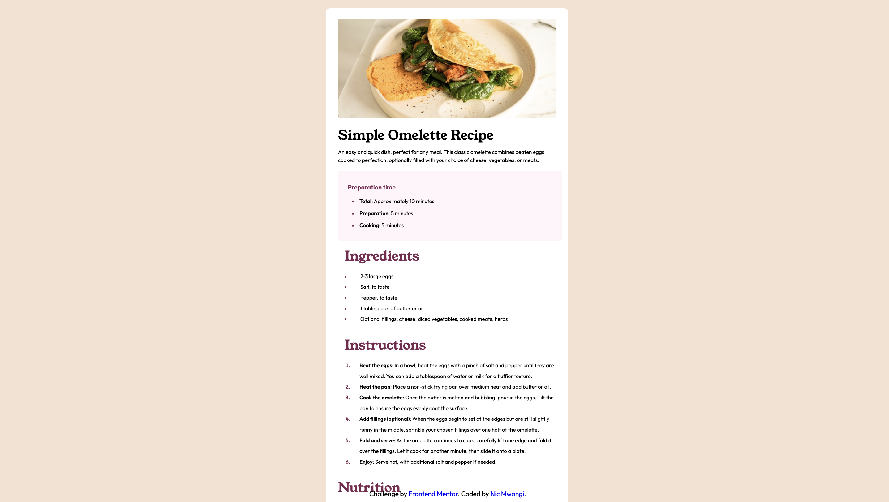

# Frontend Mentor - Recipe page solution

This is a solution to the [Recipe page challenge on Frontend Mentor](https://www.frontendmentor.io/challenges/recipe-page-KiTsR8QQKm). Frontend Mentor challenges help you improve your coding skills by building realistic projects. 

## Table of contents

- [Overview](#overview)
  - [The challenge](#the-challenge)
  - [Screenshot](#screenshot)
  - [Links](#links)
- [My process](#my-process)
  - [Built with](#built-with)
  - [What I learned](#what-i-learned)
  - [Continued development](#continued-development)
  - [Useful resources](#useful-resources)
- [Author](#author)


*## Overview

### The challenge

Users should be able to:

- See hover and focus states for all interactive elements on the page

### Screenshots




### Links


- Live Site URL: [Add live site URL here](https://saintnic84.github.io/recipe-page/)

## My process

### Built with

- Semantic HTML5 markup
- CSS custom properties
- CSS Grid
- Mobile-first workflow

### What I learned

I learned how to better use table row and table data elements. Padding and margin, are really the best elements you can use to make your website look the way you want it. Also, I developed some really good experience in using @media query to make this project smartphone suitable. I feel that will help later when developing projects

```html
 <table>
          <tbody>
            <tr>
              <td>Calories</td>
              <td><strong>277kcal</strong></td>
            </tr>
            <tr>
              <td>Carbs</td>
              <td><strong>0g</strong></td>
            </tr>
            <tr>
              <td>Protein</td>
              <td><strong>20g</strong></td>
            </tr>
          </tbody>

        </table>
```
```css
@media only screen and (max-width: 375px) {

    .construct,
    .egg,
    .pink {
        width: 17.5rem;
        padding: 1;
        justify-content: center;
        align-items: center;
        margin: 0 auto;
        flex-direction: column;
    }
}
```


### Useful resources

- [Mozilla Developer Network](https://developer.mozilla.org/en-US/) - This website is one of the resources online for front end developers. If there's a concept, code, or element you don't understand, you can probably find it at this site. This is where I got better equiped at understanding margin and padding.
- [W3schools](https://www.w3schools.com/) - This is a great website for both front end and back end programming languages, I regulary visit here to refresh concepts that I may have forgotten


## Author

- Website - [Nic Mwangi](https://saintnic84.github.io/)
- Frontend Mentor - [@saintnic84](https://www.frontendmentor.io/profile/saintnic84)


